## Backstory
My brother made a application for Counter-Strike, [CS:GO Runner](https://www.csgorunner.com/). At first, it didn't attract any audience.

A quite famous YouTuber, [BananaGaming](https://www.youtube.com/user/OfficialBananaGamers) found the app, made a review of it and the whole app blew up from a active user perspective.

Because my brother has worked with a client within the eSport industry, he showed them the application and the response he had got was great. They could se synergies between their app and ours.

A decision was made that I should travel to Sweden, meet the CEO of this eSporting company and help my brother get our app into a presentational state for a person of that prestigous stature.

On the 30th of November I kissed my wife good bye, for what I thought would be a week away from her, and jumped on a flight to Stockholm.

## How everything folded out
We sat a couple of days to finish up a presentation and adding some finishing touches on the app.
We booked the meeting, because my brother basically had a first-name-basis-relationship with the CEO.

Meeting began and both parties stumble a little bit in the beginning because there wasn't really a fixed agenda from either end of the table. But we soon found our groove and we came into a flow and I would describe it as "we clicked".

### Discussions about investing
The discussions we had was everything from them wanting to buy our app, to us coming to work for them as consultants and/or them investing in our app. We made it clear that they were more than happy to invest in the app but it was not up for grabs.

Two days goes by, and the CEO calls back and wants us to meet again, this time with their board members present, which is a very good indication that they wants to invest.
But during these two days, me and my brother had developed the worst case of flu I have ever experienced. So we asked kindly if we could reschedule for a later date.

After this... we haven't heard a word from them. I have no idea why. Because they haven't answered any emails, SMS or phone call from us.

## A new decision was made
We have been waiting for a reply... During this period, we have worked quite extensively and made HUGE improvements on the app that is soon gonna be released. And with the new release, we can see both commercial, creative and gaming value being generated.

And thats when we made the decision to stay and try to finish version 2.0 of the app.

So, this is were we stand as of right now. I'll give you some pictures from my travels in Sweden so far.

  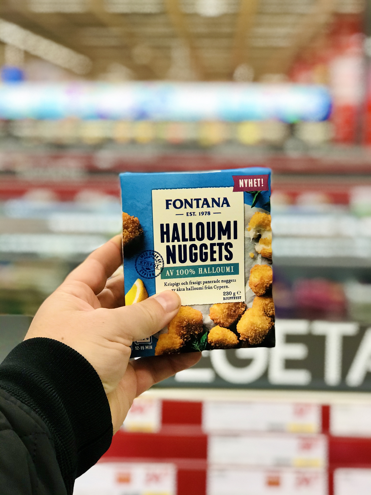

  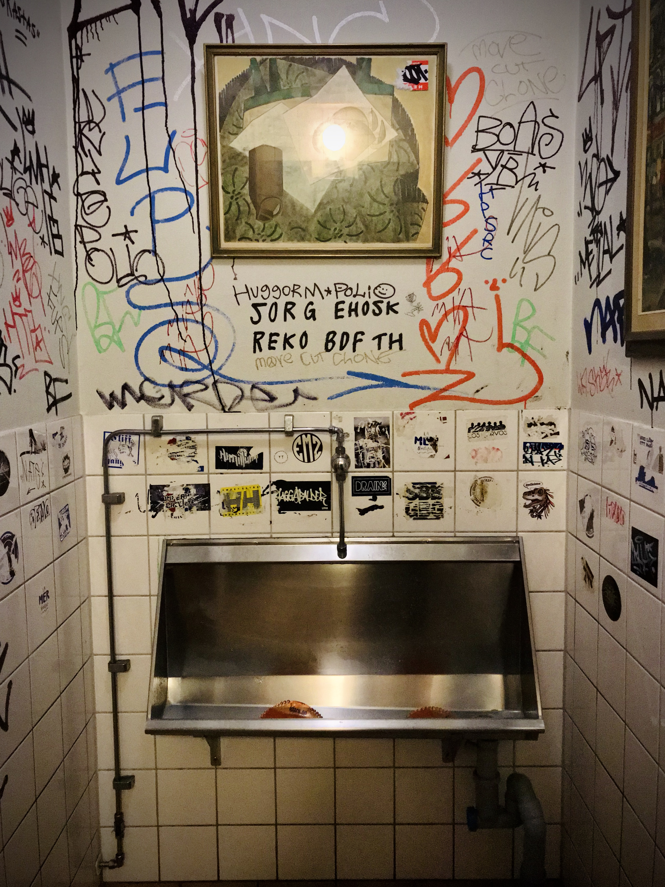

  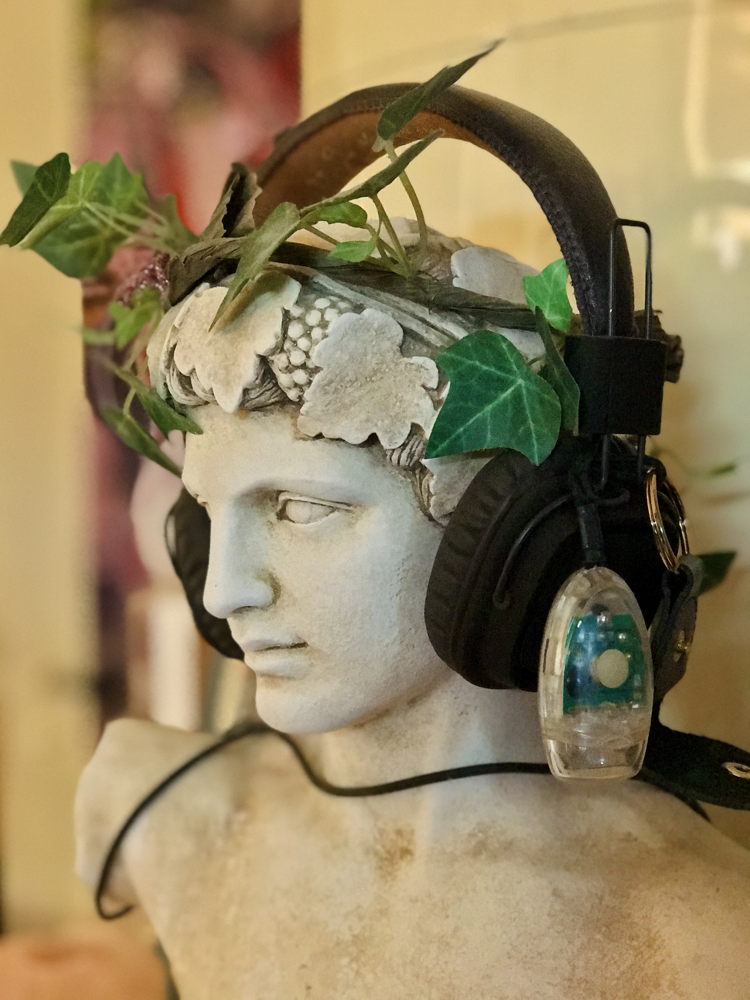

  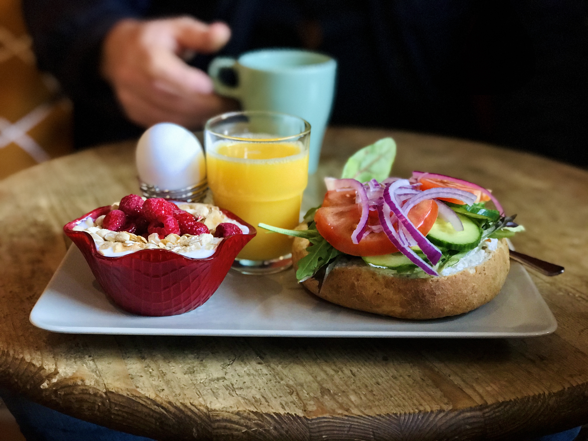

  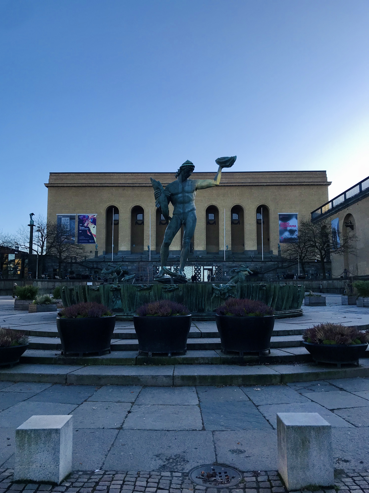

  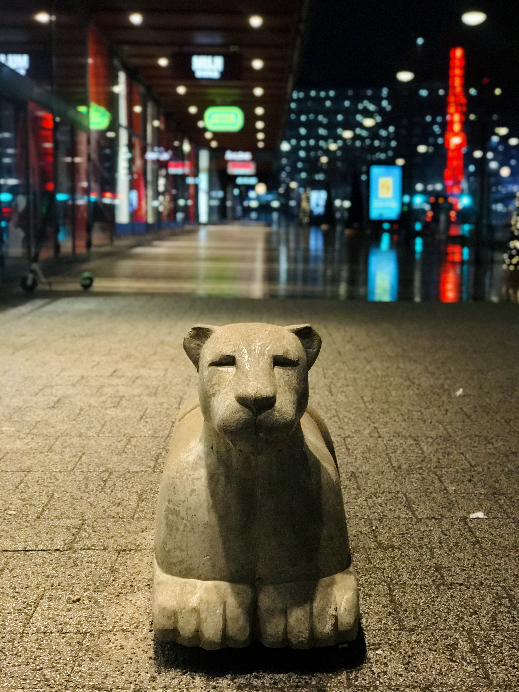

  

  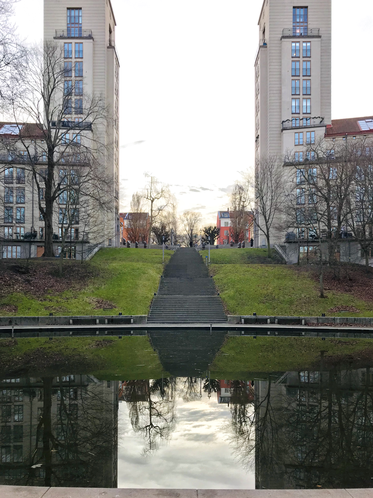

  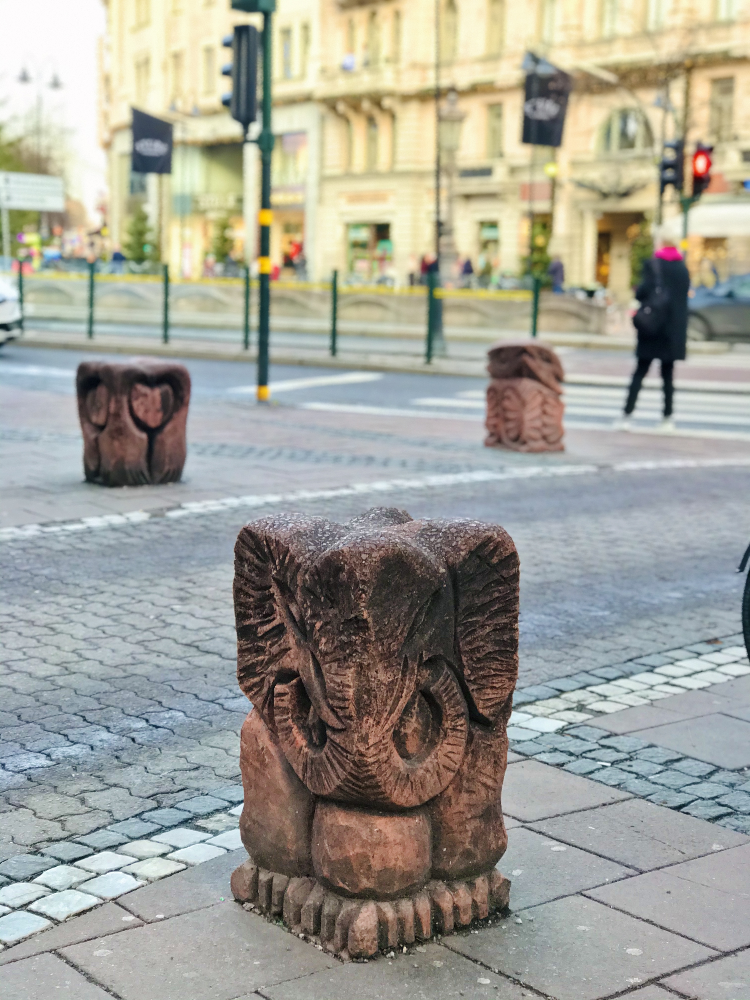

  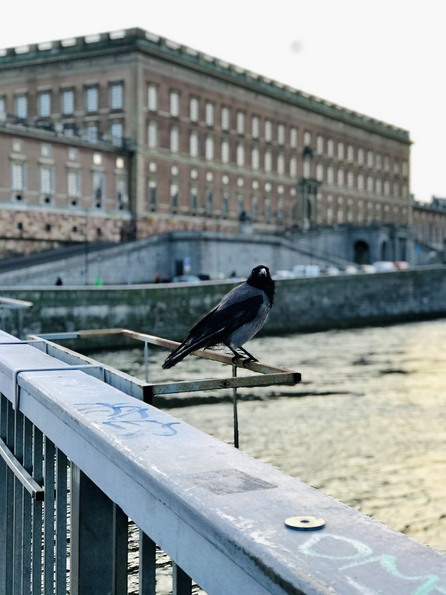

  

  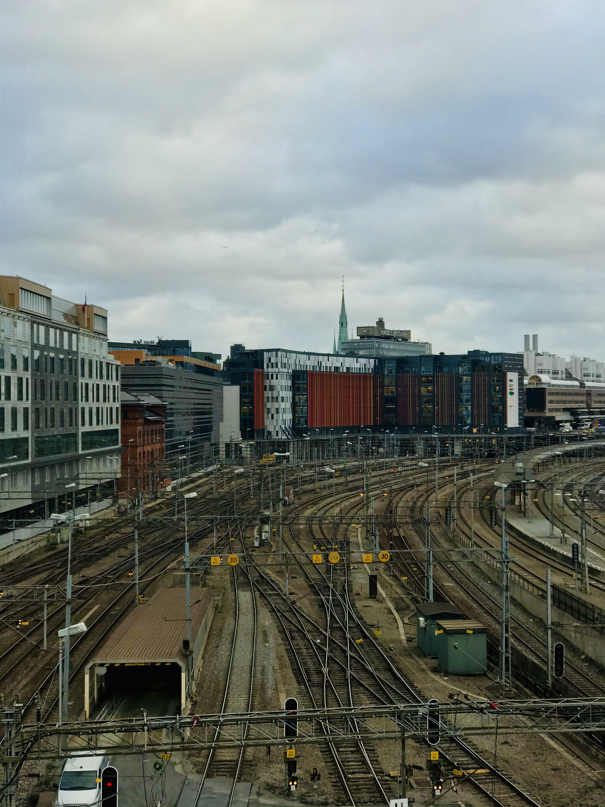

  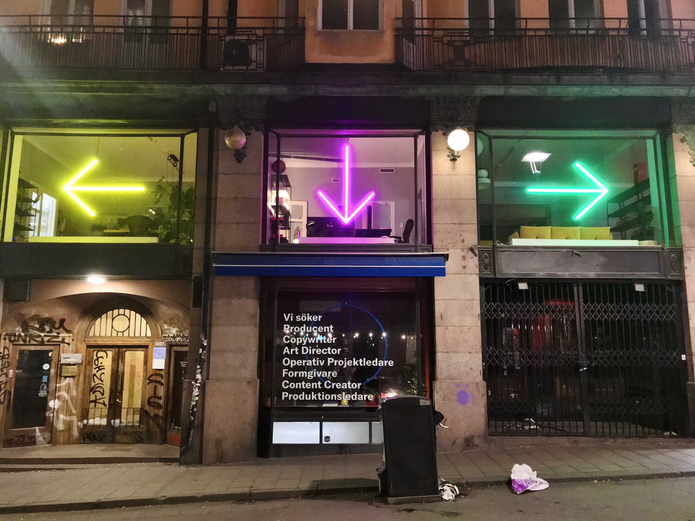

  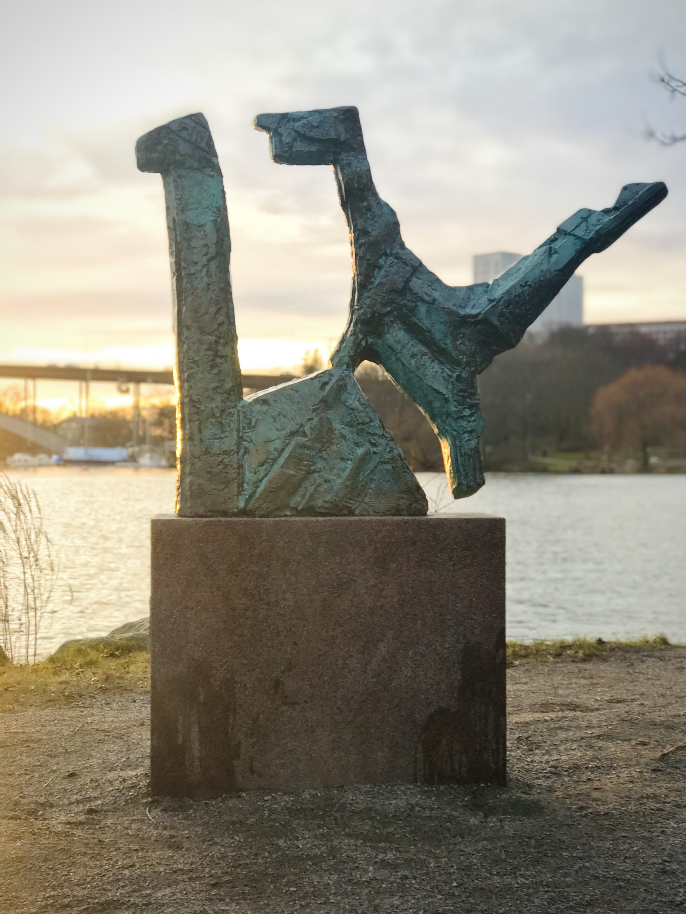

  

  

